# Chat-Core

**🚀 Live Demo: [https://chatcore-ai.com/](https://chatcore-ai.com/)**

## UI Preview


## 🎬 Demo Videos

Click a thumbnail to open the video on YouTube.

<p align="center">
  <a href="https://youtu.be/tdPZJdZfeQ0" target="_blank" rel="noopener noreferrer">
    
  </a>
  <br>
  <sub><b>▶ Watch Demo Video</b></sub>
</p>

## Overview
Chat-Core is a FastAPI-based AI chat application with email-based authentication, persistent + ephemeral conversations, and prompt sharing. It integrates with Groq and Google Gemini APIs, uses PostgreSQL for storage, and ships with a Next.js frontend.

## Key Features
- **Email-based authentication** with 6‑digit verification codes
- **Persistent + ephemeral chat** modes
- **Prompt sharing** with search and public visibility controls
- **Groq / Gemini integrations** for LLM responses

## Tech Stack
- **Backend**: FastAPI (Python)
- **Frontend**: Next.js
- **Database**: PostgreSQL
- **Optional**: Redis (for auth/session enhancements)

## Quick Start (Docker Compose)
> This project standardizes local execution on Docker Compose.

```sh
# 1) Clone the repository
git clone https://github.com/kota-kawa/Chat-Core.git
cd Chat-Core

# 2) Create a .env file with required environment variables
# Example:
# GROQ_API_KEY=xxxxx
# Gemini_API_KEY=xxxxx
# FASTAPI_SECRET_KEY=xxxxx
# SEND_ADDRESS=example@gmail.com
# SEND_PASSWORD=app_password
# ADMIN_PASSWORD_HASH=pbkdf2_sha256$...
# POSTGRES_HOST=db
# POSTGRES_USER=postgres
# POSTGRES_PASSWORD=postgres
# POSTGRES_DB=strike_chat
# FRONTEND_URL=http://localhost:3000

# 3) Build and run
docker-compose up --build
```

- Frontend: `http://localhost:3000`
- API: `http://localhost:5004`

## Database Migrations (Alembic)
For existing environments, apply incremental DB changes with Alembic:

```sh
# Install dependencies first
pip install -r requirements.txt

# Apply all migrations
alembic upgrade head
```

- `db/init.sql` remains the bootstrap schema for brand-new databases.
- Default task definitions are centralized in `frontend/data/default_tasks.json` and seeded on startup.
- `alembic/versions/` contains incremental migration history.
- `db/performance_indexes.sql` is kept as a direct SQL fallback for index-only updates.

## Required Environment Variables
Set these in `.env` or in `docker-compose.yml`:
- `GROQ_API_KEY`: Groq API key
- `Gemini_API_KEY`: Google Generative AI API key
- `GOOGLE_CLIENT_ID` / `GOOGLE_CLIENT_SECRET`: Google OAuth client credentials
- `GOOGLE_PROJECT_ID`: Google OAuth project ID (`project_id` in client config)
- `GOOGLE_JS_ORIGIN`: allowed JavaScript origin for Google OAuth (default: `https://chatcore-ai.com`)
- `GROQ_MODEL`: Groq model name used by OpenAI SDK (default: `openai/gpt-oss-20b`)
- `GEMINI_DEFAULT_MODEL`: default Gemini model when `model` is omitted (default: `gemini-2.5-flash`)
- `LLM_DAILY_API_LIMIT`: daily cap for total `/api/chat` LLM calls across all users (default: `300`)
- `AUTH_EMAIL_DAILY_SEND_LIMIT`: daily cap for login/verification email sends across all users (default: `50`)
- `FASTAPI_SECRET_KEY`: session secret (`FLASK_SECRET_KEY` is supported as a legacy fallback)
- `ADMIN_PASSWORD_HASH`: hashed admin password in format `pbkdf2_sha256$iterations$salt$hash` (no in-code default)
- `SEND_ADDRESS` / `SEND_PASSWORD`: Gmail account for verification emails (`EMAIL_SEND_PASSWORD` is accepted as a legacy fallback)
- `POSTGRES_HOST` / `POSTGRES_USER` / `POSTGRES_PASSWORD` / `POSTGRES_DB`: PostgreSQL settings
- `DB_POOL_MIN_CONN` / `DB_POOL_MAX_CONN`: DB connection pool min/max size (defaults: `1` / `10`)
- `REDIS_HOST` / `REDIS_PORT` / `REDIS_DB` / `REDIS_PASSWORD` (optional): Redis settings
- `FASTAPI_ENV`: set to `production` to enable stricter SameSite/Secure settings (`FLASK_ENV` is supported as a legacy fallback)

Generate `ADMIN_PASSWORD_HASH` with:

```sh
python3 -c "from services.security import hash_password; print(hash_password('your_admin_password_here'))"
```

## Project Structure
- `app.py`: FastAPI entry point
- `blueprints/`: feature modules (auth, chat, memo, prompt_share, admin)
- `services/`: shared integrations (DB, LLM, email, user helpers)
- `templates/` and `static/`: global HTML/CSS/JS assets
- `db/init.sql`: initial PostgreSQL schema
- `frontend/`: Next.js frontend

## Architecture Diagram


## Design Decisions
- **Why FastAPI (instead of Flask)**: FastAPI gives async-first request handling, type-driven validation, and automatic OpenAPI docs. This reduces API integration friction and keeps backend contracts explicit.  
  Trade-off: stricter typing and async patterns add some implementation complexity.
- **Why Redis for session/state (optional)**: When Redis is available, sessions are stored server-side and shared across instances, which improves horizontal scalability and supports operational controls (e.g., centralized invalidation, quota/ephemeral state handling).  
  Trade-off: extra infrastructure and operational overhead.
- **Why PostgreSQL as the primary datastore**: Core entities (users, chats, prompts, admin data) are relational and consistency-sensitive. PostgreSQL provides strong integrity guarantees plus mature indexing/migration workflows.
- **Why Next.js for frontend**: Next.js supports route-based UI composition and production-ready optimization while allowing incremental migration from legacy static/script assets.

## Engineering Highlights (for reviewers)
- **Modular design**: feature-specific blueprints keep routing and templates scoped and maintainable.
- **Clear separation of concerns**: integrations live in `services/`, keeping HTTP handlers thin and testable.
- **Security-aware defaults**: environment-based session configuration and secret management via `.env`.
- **Composable UI assets**: shared global assets with page-specific entrypoints for predictable styling.

## CSS Guidelines
- `static/css/base/`: reset, variables, common layout primitives
- `static/css/components/`: reusable UI components (e.g., sidebar, modal)
- `static/css/pages/<page>/index.css`: page entrypoints (import base + components)

Use BEM-style `kebab-case` class names and document purpose/dependencies at the top of each file.

## Production Notes
- Set `FASTAPI_ENV=production` to enable secure cookie settings.
- Keep secrets out of version control; use `.env` or a secrets manager.
- Pin dependencies and update regularly.

## License
Copyright (c) 2026 Kota Kawagoe

Licensed under the Apache License, Version 2.0 - see the [LICENSE](LICENSE) file for details.

---

<details>
<summary>日本語版 (クリックして展開)</summary>

**🚀 ライブデモ: [https://chatcore-ai.com/](https://chatcore-ai.com/)**

## UI Preview


## 🎬 Demo Videos

Click a thumbnail to open the video on YouTube.

<p align="center">
  <a href="https://youtu.be/tdPZJdZfeQ0" target="_blank" rel="noopener noreferrer">
    
  </a>
  <br>
  <sub><b>▶ デモ動画を見る</b></sub>
</p>

## 概要
Chat-Core は FastAPI で構築した AI チャットアプリです。メール認証・永続／エフェメラルチャット・プロンプト共有を備え、Groq と Google Gemini API に対応しています。PostgreSQL を採用し、Next.js フロントエンドと連携します。

## 主な機能
- **メール認証**（6 桁コード）
- **永続／エフェメラル**のチャット
- **プロンプト共有**（公開・検索）
- **Groq / Gemini 連携**

## 技術スタック
- **Backend**: FastAPI (Python)
- **Frontend**: Next.js
- **Database**: PostgreSQL
- **Optional**: Redis

## 実行方法（Docker Compose）
> 実行方法は Docker Compose に統一しています。

```sh
# 1) リポジトリを取得
git clone https://github.com/kota-kawa/Chat-Core.git
cd Chat-Core

# 2) .env に必要な環境変数を設定
# GROQ_API_KEY=xxxxx など

# 3) ビルド＆起動
docker-compose up --build
```

- フロントエンド: `http://localhost:3000`
- API: `http://localhost:5004`

## データベースマイグレーション（Alembic）
既存環境への段階的なDB変更は Alembic で適用します。

```sh
# 先に依存関係をインストール
pip install -r requirements.txt

# 全マイグレーションを適用
alembic upgrade head
```

- `db/init.sql`: 新規DBの初期スキーマ
- 既定タスク定義は `frontend/data/default_tasks.json` を単一ソースとして起動時に投入
- `alembic/versions/`: 段階的な変更履歴
- `db/performance_indexes.sql`: インデックスのみを直接適用するフォールバックSQL

## 必要な環境変数
- `GROQ_API_KEY`: Groq API キー
- `Gemini_API_KEY`: Google Generative AI API キー
- `GOOGLE_CLIENT_ID` / `GOOGLE_CLIENT_SECRET`: Google OAuth クライアント資格情報
- `GOOGLE_PROJECT_ID`: Google OAuth の project_id
- `GOOGLE_JS_ORIGIN`: Google OAuth の JavaScript origin（デフォルト: `https://chatcore-ai.com`）
- `GROQ_MODEL`: OpenAI SDK経由で使うGroqモデル名（デフォルト: `openai/gpt-oss-20b`）
- `GEMINI_DEFAULT_MODEL`: `model`未指定時に使うGeminiモデル（デフォルト: `gemini-2.5-flash`）
- `LLM_DAILY_API_LIMIT`: 全ユーザー合計の`/api/chat`経由LLM呼び出し日次上限（デフォルト: `300`）
- `AUTH_EMAIL_DAILY_SEND_LIMIT`: 全ユーザー合計のログイン/認証メール送信日次上限（デフォルト: `50`）
- `FASTAPI_SECRET_KEY`: セッション用シークレット（`FLASK_SECRET_KEY` は旧環境向けフォールバックとして利用可）
- `ADMIN_PASSWORD_HASH`: 管理者パスワードのハッシュ（形式: `pbkdf2_sha256$iterations$salt$hash`、コード内デフォルトなし）
- `SEND_ADDRESS` / `SEND_PASSWORD`: 認証メール送信用 Gmail（`EMAIL_SEND_PASSWORD` は旧環境向けフォールバックとして利用可）
- `POSTGRES_HOST` / `POSTGRES_USER` / `POSTGRES_PASSWORD` / `POSTGRES_DB`: PostgreSQL 設定
- `DB_POOL_MIN_CONN` / `DB_POOL_MAX_CONN`: DB コネクションプール最小/最大数（デフォルト: `1` / `10`）
- `REDIS_HOST` / `REDIS_PORT` / `REDIS_DB` / `REDIS_PASSWORD`（任意）: Redis 設定
- `FASTAPI_ENV`: `production` で SameSite/Secure 設定を強化（`FLASK_ENV` は旧環境向けフォールバックとして利用可）

`ADMIN_PASSWORD_HASH` の生成例:

```sh
python3 -c "from services.security import hash_password; print(hash_password('your_admin_password_here'))"
```

## ディレクトリ構成
- `app.py`: FastAPI エントリーポイント
- `blueprints/`: 機能別モジュール（auth, chat, memo, prompt_share, admin）
- `services/`: DB/LLM/メールなど共通処理
- `templates/`・`static/`: 共有 HTML/CSS/JS
- `db/init.sql`: 初期スキーマ
- `frontend/`: Next.js フロントエンド

## アーキテクチャ図

```mermaid
flowchart LR
    U[ユーザーブラウザ]
    FE[Next.js フロントエンド]
    API[FastAPI バックエンド]
    BP[Blueprints<br/>auth/chat/memo/prompt_share/admin]
    SV[Services<br/>db/llm/email/user]
    DB[(PostgreSQL)]
    RD[(Redis 任意)]
    LLM[Groq / Gemini API]
    EM[メールプロバイダ]

    U --> FE --> API
    API --> BP --> SV
    SV --> DB
    SV --> RD
    SV --> LLM
    SV --> EM
```


## 技術的な意思決定（Design Decisions）
- **なぜ FastAPI（Flask ではなく）を選んだか**: 非同期処理、型ヒントベースのバリデーション、自動生成される OpenAPI ドキュメントを活用し、API 連携と仕様の明確化を優先したためです。  
  トレードオフ: 型定義と async の実装負荷は増えます。
- **なぜ Redis をセッション/状態管理に使うか（任意）**: Redis 利用時はセッションをサーバー側で一元管理でき、複数インスタンス構成でも共有しやすく、失効制御やクォータ/エフェメラル状態の運用がしやすくなります。  
  トレードオフ: 追加インフラの運用コストが発生します。
- **なぜ PostgreSQL を主データストアにしたか**: ユーザー・チャット・プロンプト・管理データは関係性と整合性が重要なため、整合性保証・インデックス・マイグレーションが成熟した PostgreSQL を採用しています。
- **なぜ Next.js を採用したか**: ルート単位でUIを構成しつつ本番最適化を行え、既存の静的アセット/スクリプト構成から段階的に移行しやすいためです。

## レビュー観点の強み
- **機能単位の分割設計**で保守性を高めた構成
- **責務分離**によるテスト容易性の向上
- **セキュリティ前提の設定**（環境変数による秘密管理）
- **CSS の再利用性**を意識した構造化

## CSS ガイドライン
- `static/css/base/`: リセット／変数／共通レイアウト
- `static/css/components/`: 再利用可能な UI
- `static/css/pages/<page>/index.css`: ページ単位のエントリーポイント

BEM 風の `kebab-case` を推奨し、ファイル冒頭に目的・依存関係を記載します。

## 本番運用のポイント
- `FASTAPI_ENV=production` で Secure 設定を有効化
- 秘密情報は `.env` or シークレット管理へ
- 依存関係の定期更新を推奨

## ライセンス
Copyright (c) 2026 Kota Kawagoe

Apache License, Version 2.0 の下でライセンスされています。詳細は [LICENSE](LICENSE) を参照してください。

</details>
